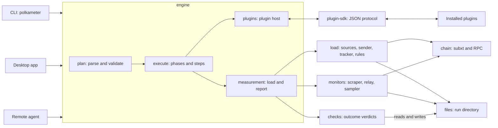
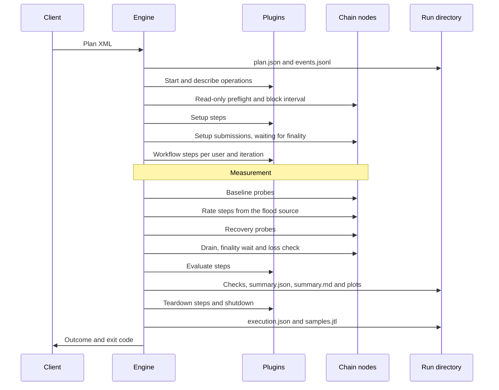

Polkameter is a Cargo workspace. The three front ends (the CLI, the desktop app and the remote agent) all call one engine. The engine plans and executes a run. Measurement, monitors and checks are separate crates that communicate through files in the run directory, so each part can run as its own process or be tested without a chain.

## Front ends

The CLI, the desktop app and the remote agent are all in the `polkameter` package under `src-tauri/`. The CLI's modules do not call Tauri APIs, but they are built into the same library crate as the desktop app.

| Front end | Source | Role |
| --- | --- | --- |
| CLI (`polkameter`) | `src-tauri/src/cli.rs`, entry point `src-tauri/src/cli_main.rs` | Commands for plugins, validation, preflight, runs, reports and the agent |
| Desktop app (`polkameter-desktop`) | `src-tauri/src/main.rs`, with the TypeScript frontend in the repository's `src/` | Edits plans, derives input editors from plugin manifests and runs them |
| Remote agent | `src-tauri/src/remote.rs` | An HTTP API that starts and stops runs on a worker host |

`src-tauri/src/plugin_application.rs` holds the run lifecycle for the desktop app and the agent: starting a run in the background, reporting its status and phase, and stopping it. `crates/engine/src/plots.rs` writes the SVG plots, as the run finishes and as `polkameter report` runs.

## Crates

### engine (`crates/engine`, `polkameter-engine`)

The engine turns a plan into a run. It is shared by all three front ends.

- **Plan.** `plan::Plan` is the XML plan, parsed by the hand-written reader in `xml.rs` (the engine depends on no XML crate) and validated. `Step`, `Workflow`, `Load` and `Thresholds` are its main parts. See [Plans]({{ '/plans.html' | relative_url }}).
- **Registry.** `plugins::Registry` records the installed plugins, their pinned versions and BLAKE2 hashes, the credential profiles and topology aliases of this host, and the capabilities the provisioner declared. It is stored in `~/.config/polkameter/plugins.json` unless `POLKAMETER_PLUGIN_REGISTRY` is set.
- **Plugin host.** `plugins::Plugins` starts one process per installed plugin for the duration of a run and sends it operations.
- **Executor.** `execute::run` creates the run directory and runs the phases. `execute::preflight` and `execute::inspect` run the read-only parts without starting a run. The run's result is `execute::Outcome`, written as `execution.json`.
- **Measurement wiring.** `measurement::run` connects the load to the chain and the monitors, runs the load phases and reconciles the transactions. `measurement::report` writes the checks.

It writes `plan.json`, `resolved-plan.json`, `resolved-targets.json`, `calibration.json`, `events.jsonl`, `execution.json`, `samples.jtl` and, when there is a fallback, `summary.md`. Through measurement it also writes `steps.jsonl`, `lost.jsonl`, `transactions.jsonl`, `summary.json` and `plugin-checks.json`. [Results and verdicts]({{ '/results.html' | relative_url }}) describes each file.

### load (`crates/load`, `polkameter-load`)

The runner: load sources, the sender, the tracker, the rate plan, the stop rules and the loss check. It knows nothing about monitors.

- **Sources.** `source::QueueSource` holds a lane's prepared transactions: the flood, and the reserved probes, which must be disjoint. `Tx` is one transaction ready to send.
- **Rate plan.** `plan::Plan` is a list of `StepPlan`s, each a duration and a target rate per lane. `Plan::ramp` (linear) and `Plan::geometric` (multiplicative) build them from a `<ramp>`.
- **Sender.** `sender::Sender` sends `author_submitExtrinsic` over several WebSocket connections, round robin. It does not wait for one reply before sending the next.
- **Tracker.** `tracker::Tracker` owns every transaction and its state. It is fed the send ticks, the submit replies and the block events, and it writes `load.jsonl` and `blocks.jsonl`.
- **Follower.** `follower` reads the best and finalized blocks in arrival order, so a source sees inclusions in block order.
- **Runner.** `runner` runs the phases: baseline, load and recovery. `rules::RULES` holds the default thresholds, `recovery` decides when the chain is back, and `loss::loss_check` reconciles every transaction after the finality wait.

### chain (`crates/chain`, `polkameter-chain`)

One node over RPC. It provides the typed reads that the load, the recorders and the setup steps use. The load's sender bypasses it for the hot path of submissions, as described under load.

- `client::Client` uses subxt (pinned to 0.50.3) for typed reads at a block, and plain JSON-RPC for the calls subxt does not wrap, such as `state_call` and the `author_*` methods. `block_interval_s` measures the block interval for calibration.
- `reads` and `tx` provide the typed fetches and the transaction hash.
- Errors are the chain's. The caller decides whether an error stops a setup step or is a result of the run.

### monitors (`crates/monitors`, `polkameter-monitors`)

Each monitor is a task that writes its own raw file. A node that does not answer is recorded as a result and does not stop the run. Only a failure of Polkameter itself, such as a file it cannot write, ends a monitor.

- **Scraper.** `scraper::Scraper` scrapes `/metrics` of every node in the topology and writes `scrapes.jsonl`. Only the metric families in the registry are kept.
- **Relay recorder.** `relay` follows the relay chain's finalized blocks and records, for the observed parachain, the candidates backed, included and timed out, the disputes, and the slots offered. It writes through `chain_series` to `chain.jsonl`.
- **Process sampler.** `process` samples the CPU and memory of the node under load with `ps` into `node.jsonl`. It uses `POLKAMETER_NODE_PID`, or else the process listening on the node's RPC port.
- **Topology.** `topology` reads a Zombienet `zombie.json` and assigns each node a role: `collator`, `collator-relay` or `validator`.
- **Preflight and walker.** `preflight` checks that every node answers and that each metric has the type the registry expects. `walker` visits finalized blocks one number at a time, for recorders that must see every block.

### files (`crates/files`, `polkameter-files`)

The on-disk contract of a run. Every part of a run writes its own raw file here, and `read_store` merges them into the series the checks read. Other crates depend on these formats, not on each other.

- `run_dir::RunDir` opens a run directory. `JsonlWriter` appends one record per line, and `write_json` writes pretty JSON.
- `registry` lists every metric a run reads or writes, with its type, unit and labels. The preflight checks each node metric's `# TYPE` against it. The same module defines the check groups (`registry::Outcome`).
- `series::SeriesWriter` writes Polkameter's own `polkameter_*` series: gauges at once, counters and histograms at most once a second.
- `summary` defines `Summary` (the content of `summary.json`), the stop, breaking point and failure types, and the loss and recovery records.
- `records` defines `FinalStep`, `BlockRecord`, `ScrapeRecord`, `SeriesRecord` and `NodeSample`.

### checks (`crates/checks`, `polkameter-checks`)

The evaluator. It reads a finished run's series and `summary.json`, runs every check and returns one verdict per check. It needs only the file formats, so it can run on any finished run.

- `RunData` does the window arithmetic: each load step and the recovery phase become windows over the series.
- `Check` is one named check of one outcome, and `Verdict` is its status, a one-line detail and optional numbers. `Status` is `pass`, `warn`, `fail`, `info` or `no result`.
- `LIMITS` holds the limits the checks compare against. They are placeholders until the budgets are agreed.
- `outcomes/` has one file per outcome: `block_production`, `pvf`, `pool` and `recorded`. [Results and verdicts]({{ '/results.html' | relative_url }}) lists every check.
- `report::write` runs the checks, appends the plugin checks, and writes `summary.json` and `summary.md`.

### plugin-sdk (`crates/plugin-sdk`, `polkameter-plugin-sdk`)

The versioned protocol between the host and a plugin, and the library plugins are written with.

- `Plugin` is the trait a plugin implements: `manifest()` returns its `Manifest`, and `invoke` runs one operation.
- `serve` runs the plugin's side of the protocol: newline-delimited JSON on stdin and stdout, with one reply per request.
- `Manifest` lists the plugin's `Operation`s. Each operation declares its `Schema` inputs and outputs, and whether it is `read_only`.
- `Context` carries the run ID, the run's artifact directory, and the user and iteration indices.
- `Artifact` and `PreparedTx` are the references for large outputs and for prepared transactions. A `PreparedTx` carries its bytes and their BLAKE2 hash.

The protocol is described in the [plugins guide]({{ '/plugins.html' | relative_url }}#plugin-protocol-1). `plugins/example` is a complete plugin that exercises it.

## How a run flows

The table maps the phases to the `phase` events in `events.jsonl`, which the CLI and the desktop app show as they run.

| Phase event | What runs |
| --- | --- |
| `preflight` | Plugin contracts and required evidence, read-only steps, and the block interval calibration |
| `setup` | Setup steps, run once |
| `workflow` | Each workflow in order, with its users and iterations |
| `measurement` | The load: `baseline`, `load`, `recovery` and `reconciliation` phases |
| `checks` | The report: the built-in checks, then the plugin checks that evaluate steps returned |
| `teardown` | Teardown steps, then plugin shutdown |

The phases run in this order. An error in preflight, setup, a workflow or an evaluate step ends the run with `state` set to `failed` and exit code 1. A stop rule that fires during measurement is not an error: it is recorded in `summary.json`, and the report is still written. [Results and verdicts]({{ '/results.html' | relative_url }}) explains which results fail a run and which only change the verdict.
